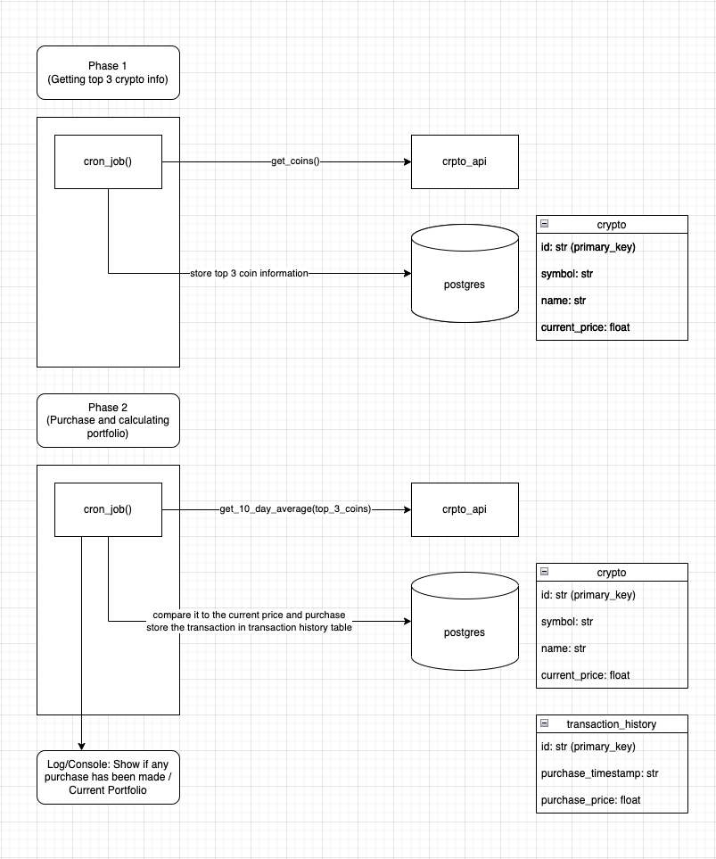

# Interview Assessment 

I focused on the fastest way to come up with a 'working' solution.
There are designs that can be improved for sure, and I'll note possible improvement points throughout this README and elaborate on how to make it 'production ready'


### Design notes


#### Two tables in postgres
- I've decided to keep top 3 crypto information in the `crypto` table(schema is in the above diagram)
- To be able to calculate the portfolio, I had to store past transactions in the `transaction_history` table(schema is in the above diagram)

#### Additional libraries/tools used in this repo
- I've used postgres as a RDS, and used sqlalchemy for making queries to the RDS.
- Used black and isort for simple, out-of-the box code formatting.

#### Design decisions and motives
- WHY postgres?
    - I spent a good 1 hr trying to set up MYSQL and MySQLdb connector in this repo to no avail, decided to use the tools that I'm comfortable with.

#### Improvements that can be made
- Overall code structure
    - Current code structure is not cleaned up since I focused on a fastest working solution. But for productionization I foresee the below structure
        ```
        ├── app
        │   ├── cron_job.py (where the actual cron job is executed)
        │   ├── helpers.py (helpers/loggers for cron_job.py)
        ├── db
        │   ├── queries
        │   │   └── queries.py
        │   └── db.py (configuring/initializing postgres connections)
        ├── api
        │   └── crypto_api.py
        ├── storage
        │   └── logs
        │       └── app.log       
        └── .gitignore
        ...
        ```
- Way the application is set up to run hourly
    - I designed this to only run in local, and this approach will not be my approach when I look at it from a production perspective.
    - Possible approaches:
        - Make a github scheduled job to run the cron_job every 1 hour interval
            - This would require a different approach to setup/maintain the postgres RDS
        - Deploy this as a AWS lambda (flask app boiler plate might be the fastest), set up the Lambda function on a recurring schedule using AWS's EventBridge
        
- Business logic perspective
    - Deciding to buy when `current_price < avg_last_10_day_price` seems like a naive approache when it comes down to dealing with cryptos (due to it's volatility)
    - I saw a lot of different metrics besides `current_price` in the api response from `crypto_api` such as `high_24h, low_24h, price_change_24h, price_change_percentage_24h, market_cap_change_24h, market_cap_change_percentage_24h` I think coming up with a more intricate algorithm using these metrics would be my first approach.


## Instructions to run the application in local
You will need the following installed on your local machine:

- Docker

Steps to get up and running

1. Run `make init` to spin up the docker container. Note you will automatically be "ssh'ed" into the main docker container from which you can run your python code.
2. Run `python app.py` to start the application. Note that this application will run until you either terminate the app manually or close the container.

### Database Access

If you would like to access the database via a GUI such as Sequel Pro or Tableplus, you can use the following credentials:

Host: `127.0.0.1`
User: `docker`
Password: `secret`
Database: `postgres`
Port: `5432`

### Expected behavior / UI
For timewindow set in line 98 in `app.py`, it will print/log the following snippet:
```
===================== Purchase made at 2022-09-26 22:21:12.951740 =====================
Purchasing 1 bitcoin for 19113.66 dollars
Purchasing 1 ethereum for 1321.21 dollars
Purchasing 1 tether for 1.0 dollars
===================== Printing results of current portfolio =====================
ID: bitcoin | Buy count: 2 | Loss/gain: 0.0 %
ID: ethereum | Buy count: 2 | Loss/gain: 0.0 %
ID: tether | Buy count: 2 | Loss/gain: 0.0 %
```
